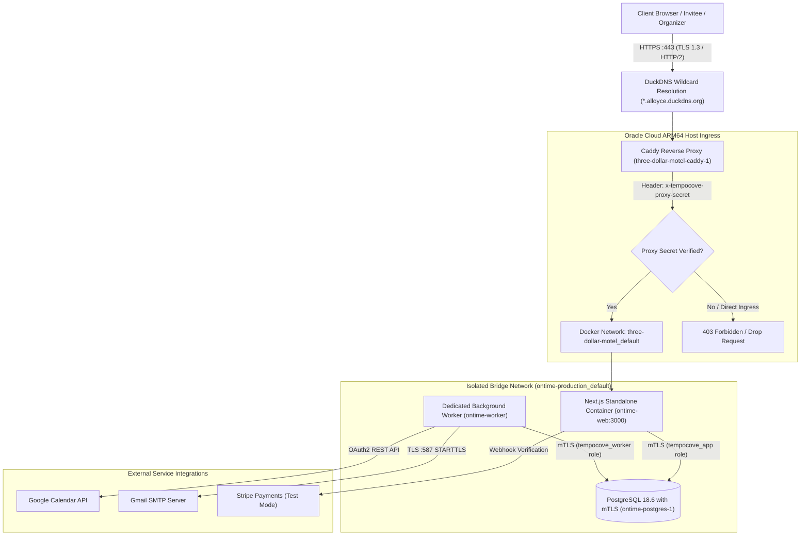
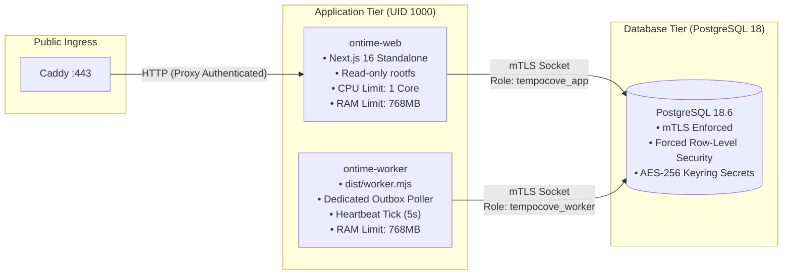
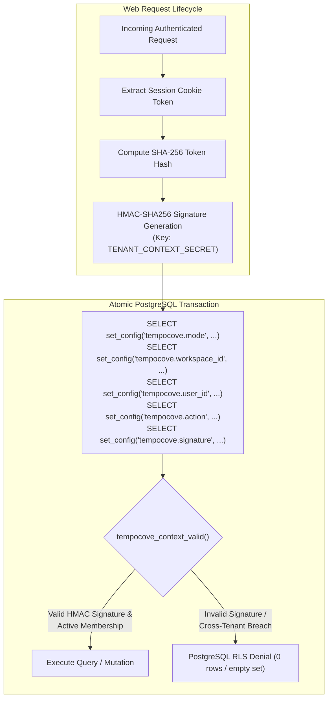
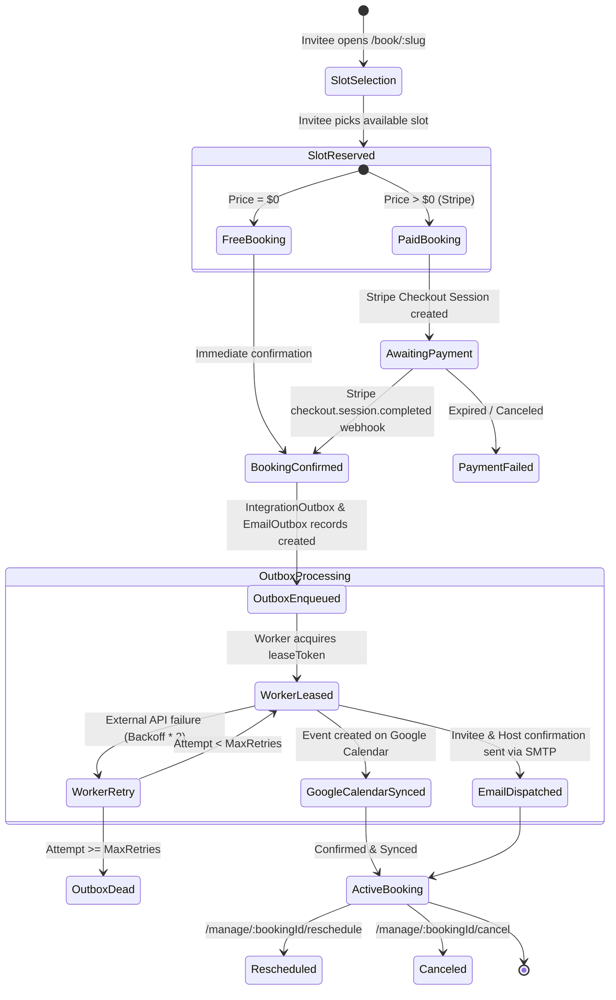
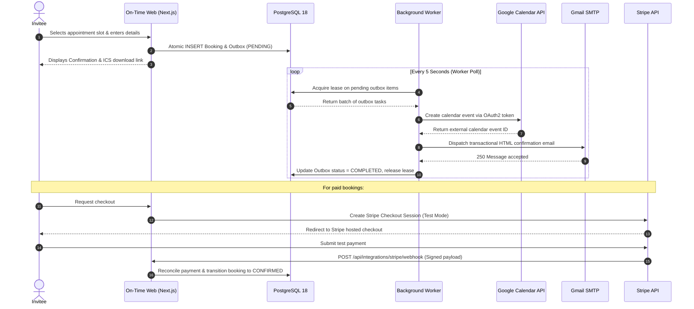
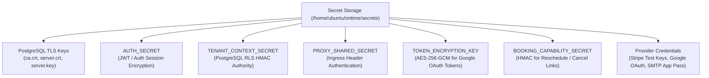

# On-Time Architecture & System Design

**On-Time** ("On Time all the time") is an autonomous, self-hostable appointment scheduling platform engineered for strict tenant isolation, zero-trust data segregation, verifiable TLS everywhere, and audited asynchronous job dispatch.

---

## 1. System Ingress & Network Topology

All public traffic terminates at Caddy, which manages automated Let's Encrypt TLS certificates, enforces HTTP/2 and modern cipher suites, and verifies reverse-proxy provenance via an authenticated shared secret header before requests ever touch application workers.

---

## 2. Container Topology & Resource Boundary

Each component runs within a strictly constrained container boundary:
- **`ontime-web`**: Read-only root filesystem with an ephemeral 64MB `tmpfs` at `/tmp`. Non-root UID/GID 1000:1000 (`node:node`), all Linux capabilities dropped (`cap_drop: [ALL]`), `no-new-privileges: true`.
- **`worker`**: Dedicated background outbox processor (`worker.mjs`), non-root, read-only rootfs, isolated from public ingress.
- **`postgres`**: PostgreSQL 18.6 hardened container with certificate authority (CA), server certificate SAN enforcement (`DNS:postgres,DNS:localhost`), and 5 segregated SQL database roles.

---

## 3. Row-Level Security (RLS) & Signed Context Authority

Tenant segregation is enforced at the database kernel level using PostgreSQL Row-Level Security. Application queries cannot query across workspace boundaries even in the event of an application logic vulnerability.

### PostgreSQL Database Roles

| Role Name | Access Type | Responsibilities |
| :--- | :--- | :--- |
| `tempocove_owner` | Schema Owner | Baseline DDL migrations, trigger creation, extension management. Non-login in production app flow. |
| `tempocove_app` | Web Application | DML queries with signed tenant context (`tempocove_workspace_actor`, `tempocove_workspace_admin`). |
| `tempocove_worker` | Background Worker | Reads pending outbox jobs (`IntegrationOutbox`, `EmailOutbox`) and updates task status/leases. |
| `tempocove_migration`| Migrations | Applied schema upgrades with restricted table alters. |
| `tempocove_monitor` | Healthcheck / Probe | Read-only inspection of `WorkerHeartbeat` and database readiness function. |

---

## 4. Booking Lifecycle & Outbox State Machine

Bookings follow a strict transactional state machine. Outbox events are guaranteed to be delivered at least once with exponential backoff and lease timeouts.

---

## 5. Service Integrations & Webhook Ingestion

---

## 6. Cryptographic Key & Secret Hierarchy

