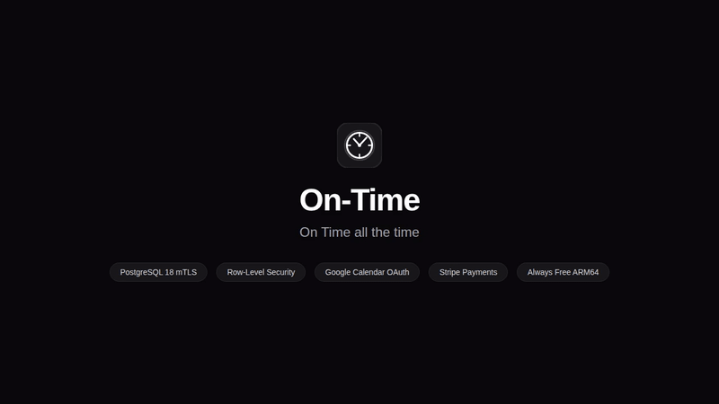
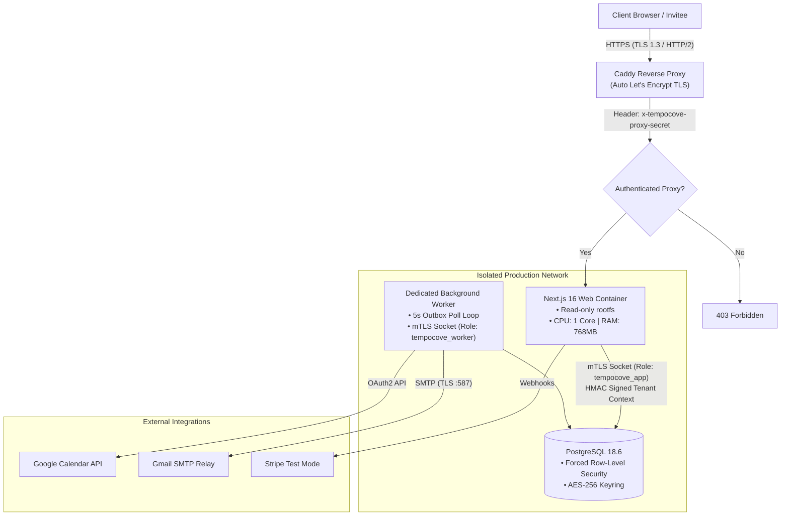

<div align="center">
  <h1>On-Time</h1>
  <p><strong>On Time all the time.</strong></p>
  <p>An autonomous, self-hostable appointment scheduling platform with verified TLS, Row-Level Security, multi-tenant isolation, Google Calendar sync, Stripe test payments, and transactional email dispatch.</p>

  <p>
    <a href="https://github.com/AmosAlloyce/on-time/actions/workflows/ci.yml"></a>
  </p>

  <p>
    <a href="https://ontime.alloyce.duckdns.org/dashboard"><strong>Live Dashboard</strong></a> •
    <a href="https://ontime.alloyce.duckdns.org/book/strategy-call"><strong>Public Booking Demo</strong></a> •
    <a href="ARCHITECTURE.md"><strong>Architecture Documentation</strong></a> •
    <a href="docs/assets/on-time-demo.mp4"><strong>Video Demo (.mp4)</strong></a>
  </p>
</div>

---

## System Demo Walkthrough



> 🎥 **Download high-resolution video demo**: [`docs/assets/on-time-demo.mp4`](docs/assets/on-time-demo.mp4)

---

## System Architecture

On-Time is engineered with a multi-layered security and isolation model. For full specifications, sequence diagrams, and entity-relationship models, see [**ARCHITECTURE.md**](ARCHITECTURE.md).



### Core Architectural Guarantees

1. **Kernel-Enforced Tenant Isolation:** PostgreSQL 18 Row-Level Security (RLS) dynamically checks HMAC-signed context tokens (`tempocove_context_valid`). Cross-tenant access is structurally impossible at the database layer.
2. **Role-Segregated PostgreSQL Logins:** 5 independent roles (`tempocove_owner`, `tempocove_app`, `tempocove_worker`, `tempocove_migration`, `tempocove_monitor`) with distinct passwords and least-privilege grants.
3. **Hardened Container Topology:** Read-only container root filesystems with ephemeral 64MB `tmpfs`, dropped Linux capabilities (`cap_drop: [ALL]`), non-root execution (`1000:1000`), and strict CPU/memory limits.
4. **Guaranteed At-Least-Once Outbox Delivery:** Database-backed outbox tables (`IntegrationOutbox`, `EmailOutbox`) with lease-based locking and exponential backoff retry.
5. **Zero-Trust Reverse Proxy Validation:** Ingress via Caddy with Let's Encrypt TLS, verifying proxy provenance via `x-tempocove-proxy-secret`.

---

## Features

- **Public Booking Flow:** Timezone-aware slot generation, custom screening questions, calendar conflict avoidance, and instant ICS calendar file generation.
- **Organizer Dashboard:** Visual overview of upcoming meetings, monthly hours booked, active booking links, and scheduling analytics.
- **Availability Engine:** Custom weekly schedules, daily time windows, date-specific overrides, buffer times (before/after), and minimum notice rules.
- **Google Calendar Integration:** Bidirectional free/busy conflict checking and automated Google Meet calendar event creation.
- **Stripe Payments (Test Mode):** Seamless integration with Stripe Checkout and automated webhook signature verification for paid appointments.
- **Transactional Notifications:** Real-time email dispatch via authenticated SMTP with DKIM/SPF alignment.
- **Custom Aesthetic:** Strict monochrome theme (Black `#09090b`, Grey `#71717a`, White `#ffffff`) with custom clock/timer branding and typography.

---

## Live Endpoints

| Resource | Public URL | Description |
| :--- | :--- | :--- |
| **Overview Dashboard** | [https://ontime.alloyce.duckdns.org/dashboard](https://ontime.alloyce.duckdns.org/dashboard) | Scheduling overview & appointment management |
| **Strategy Call Booking** | [https://ontime.alloyce.duckdns.org/book/strategy-call](https://ontime.alloyce.duckdns.org/book/strategy-call) | Public scheduling link for 30-min strategy calls |
| **Paid Strategy Session** | [https://ontime.alloyce.duckdns.org/book/paid-strategy-session](https://ontime.alloyce.duckdns.org/book/paid-strategy-session) | 60-min strategy session with Stripe test checkout |
| **Production Health** | [https://ontime.alloyce.duckdns.org/api/health/ready](https://ontime.alloyce.duckdns.org/api/health/ready) | Multi-role readiness probe & heartbeat verification |

---

## Local Development & Testing

### Prerequisites
- Node.js 20.9+ (Node 24 recommended)
- npm & Git
- SQLite (for local demo) or Docker (for production container build)

### Quick Start

```bash
# 1. Clone repository
git clone https://github.com/AmosAlloyce/on-time.git
cd on-time

# 2. Setup local development environment
npm run setup

# 3. Launch credential-free local demo
npm run demo:free
```

Open [http://localhost:3000](http://localhost:3000) with the credentials generated by `npm run setup`.

### Commands

```bash
npm run dev            # Start local Next.js development server
npm run test           # Run Vitest test suite
npm run typecheck      # Run TypeScript compiler checks
npm run lint           # Run ESLint validation
npm run build          # Create optimized Next.js standalone build
npm run ci:secret-scan # Verify no credentials exist in source code
```

---

## Project Structure

```text
apps/web/             Next.js 16 standalone application and API routes
├── src/app/          App Router pages (dashboard, booking, auth)
├── src/server/       Server actions, RLS context, database queries, and integrations
└── public/           Brand marks, icons, and theme assets
prisma/               SQLite schema, PostgreSQL 18 schema, and migrations
scripts/              Container entrypoints, login provisioning, and import tools
infrastructure/       PostgreSQL container hardening and mTLS configuration
docs/                 Integration guides, setup walkthroughs, and demo assets
ARCHITECTURE.md       Complete system architecture and Mermaid diagrams
```

---

## License

This project is licensed under the [MIT License](LICENSE).
